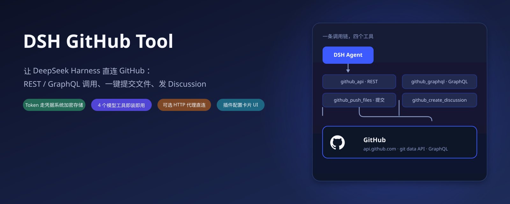
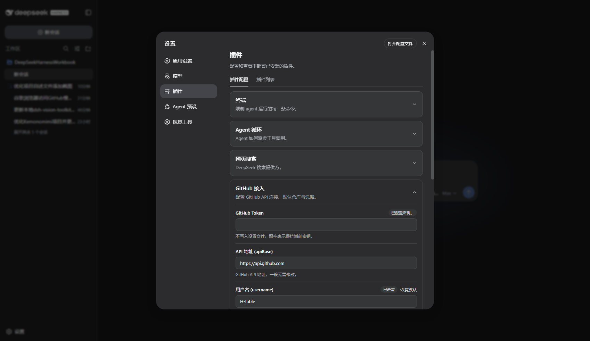
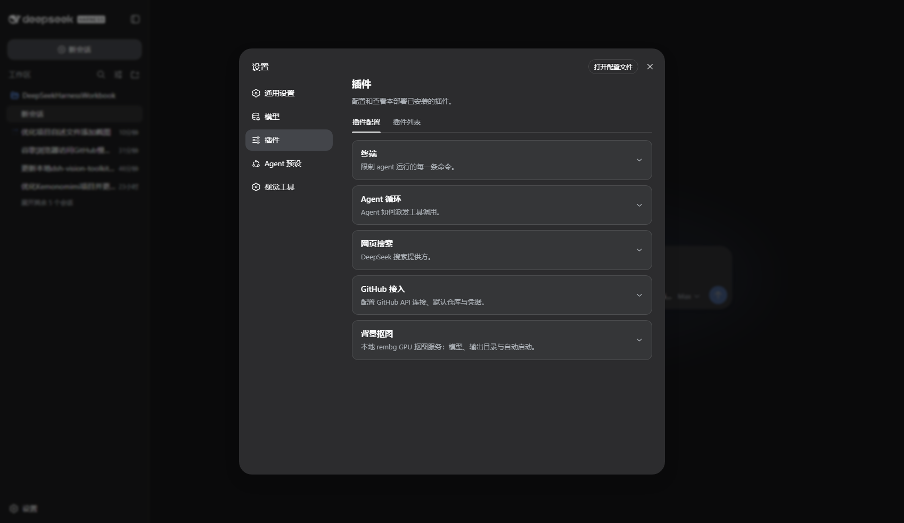
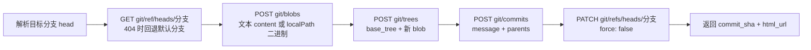

<p align="center">
  
</p>

<div align="center">

# DSH GitHub Tool

[](https://github.com/H-table/dsh-github-tool)
[](LICENSE)
[](cordis.patch.yml)
[](https://docs.github.com/rest)

**让 DeepSeek Harness 直连 GitHub：REST / GraphQL 调用、一键提交文件、发 Discussion。Token 走凭据系统加密存储，可选 HTTP 代理应对受限网络。**

🚀 对话里直接读仓库 | 多文件一次提交 | 二进制安全上传 | 发帖无需手抄 URL

</div>

在 DeepSeek Harness 里和 GitHub 打交道，通常要绕一圈：`pwsh` 里敲 `curl`、拼 token、解析 JSON，再手动处理分页和错误码。DSH GitHub Tool 把这套能力收成 4 个模型工具，Agent 在对话里就能：

- **读**：查仓库、Issue、PR、用户信息……任何 GitHub REST 端点；
- **写**：多文件单次提交（git data API 全流程），本地图片等二进制文件直接上传；
- **查**：REST 覆盖不到的场景走 GraphQL（比如 Discussion）；
- **发**：一句话创建 Discussion 帖子并拿到 URL。

Token 通过 DSH 凭据系统（`ctx.credentials`）加密存储，**永不落进设置文件**；网络受限时还可以配一个 HTTP(S) 代理（CONNECT 隧道）直连 GitHub。

## Highlights

- **4 个模型工具即装即用。** `github_api`（REST）、`github_push_files`（提交文件）、`github_graphql`（GraphQL）、`github_create_discussion`（发讨论帖），每个会话自动注册，无需额外 Skill。
- **凭据系统加密存储。** Token 写入 DSH 凭据域，配置卡只显示「已配置密钥 / 未配置密钥」，不把密钥带回浏览器、不落配置文件。
- **多文件单次提交。** `blob → tree → commit → ref` 全流程一次完成，返回 `commit_sha` 和 `html_url`；目标分支不存在时自动回退到仓库默认分支。
- **二进制安全上传。** `files[].localPath` 直接读取本地文件（如 PNG），以 base64 写入 git data API，不走文本编码。
- **可选 HTTP 代理。** CONNECT 隧道支持受限网络（如 `127.0.0.1:7897`），一个字段搞定，不需要改系统环境。
- **官方同款插件配置卡片。** 设置 → 插件 → 插件配置 →「GitHub 接入」：API 地址、用户名、默认仓库/分支、代理、凭据名、默认提交信息，暂存编辑、已覆盖标记、恢复默认。

## 界面预览

插件配置卡片长这样（设置 → 插件 → 插件配置 →「GitHub 接入」）：

<p align="center">
  
</p>

卡片与官方插件（终端、Agent 循环、网页搜索等）同列展示，交互语义一致：

<p align="center">
  
</p>

## 快速开始：三步

### 1. 安装插件（本机 profile）

```json
// ~/.dsh/profiles/web/package.json
"dependencies": { "@local/dsh-github-tool": "link:<本仓库目录>" },
"dsh": { "profile": { "bundles": ["@local/dsh-github-tool"] } }
```

并建立 `node_modules/@local/dsh-github-tool` → 本仓库目录 的符号链接，然后重启 Web Profile。

### 2. 配置 Token

GitHub → **Settings → Developer settings → Personal access tokens**，新建一个勾选 `repo` 权限的 token（发 Discussion 另需 `read:discussion` / `write:discussion` 或相应 scope）。

回到 DSH：设置 → 插件 → 插件配置 →「GitHub 接入」，在 **GitHub Token** 输入框粘贴 token 并保存。Token 写入凭据系统（默认引用名 `GITHUB_TOKEN`），卡片会显示「已配置密钥」。

顺手填上 **用户名 (username)** 和 **默认仓库 (defaultRepo)**，之后不传 `repo` 参数也能直接操作默认仓库。

### 3. 对话里直接用

```text
用 github_api 看看 H-table/dsh-github-tool 最近 5 个提交。
把 README.md 和 assets/hero.svg 提交到我的默认仓库，提交信息 "docs: 更新 README"。
把本地 C:/Users/me/logo.png 上传到 H-table/dsh-bg-tool 的 assets 目录。
在 H-table/dsh-github-tool 发一个 Discussion，标题 "想法征集"，正文 "欢迎分享使用建议"。
```

## 工具

| 工具 | 做什么 | 关键参数 | 主要结果 |
|---|---|---|---|
| `github_api` | 通用 GitHub REST 调用（直连） | `path`（无前导斜杠）、`method`（GET/POST/PUT/PATCH/DELETE）、`query`、`body`、`timeoutMs` | JSON 响应或原始文本，含 `status` |
| `github_push_files` | 多文件单次提交（上传/更新项目文件） | `repo`（默认取配置）、`branch`、`commit_message`、`files[]`（`path` + `content` 或 `localPath`） | `commit_sha`、`html_url`、上传文件数 |
| `github_graphql` | 通用 GitHub GraphQL 调用 | `query`、`variables` | `{ data, errors }`，与官方响应一致 |
| `github_create_discussion` | 一键发 Discussion 帖 | `repo`、`title`、`body`、可选 `category_id` | 帖子 `url` 与所用分类名 |

细节约定：

- `github_api` 的 `path` 不带前导斜杠，例如 `repos/octocat/Hello-World` 或 `user/repos?per_page=5`；认证头自动带 `Accept: application/vnd.github+json`、`X-GitHub-Api-Version: 2022-11-28`。
- `github_push_files` 默认目标分支取配置的 `defaultBranch`（默认 `main`）；分支不存在时自动解析仓库默认分支。
- `github_create_discussion` 自动解析仓库 ID 和讨论分类；不传 `category_id` 时使用第一个可用分类。
- 所有工具都会自动附加配置的代理与 token，无需在参数里重复传入。

## 工作原理

<details>
<summary><strong>架构与提交流程</strong></summary>

一次 `github_push_files` 在服务端走 git data API 五步：



- **凭据解析**：每次调用前从 `ctx.credentials` 解析配置的凭据引用（默认 `GITHUB_TOKEN`），未配置时返回明确的中文提示而不是裸报错。
- **设置路由**：`GET /_dsh/github-tool/settings` 返回分层快照（value / base / user + 凭据状态），`POST` 走字段级 mutate（`{op:'set'|'unset', path:[field]}`），带 revision  fencing——因为官方 settings wire 只服务硬编码白名单命名空间，第三方插件通过自己的 loopback 路由实现同等语义。
- **代理**：`proxy` 字段非空时先建立 CONNECT 隧道再走 TLS，超时默认 60s（`github_push_files` 120s），可逐调用覆盖。

</details>

## 配置

设置 → 插件 → 插件配置 →「GitHub 接入」卡片（官方卡片同款 UI：暂存编辑、已覆盖标记、恢复默认）：

| 字段 | 默认值 | 说明 |
|---|---|---|
| GitHub Token（凭据，不回显） | 引用 `GITHUB_TOKEN` | 写入凭据系统，不落设置文件；留空保持当前密钥 |
| API 地址 `apiBase` | `https://api.github.com` | GitHub API 地址，一般无需修改 |
| 用户名 `username` | 空 | 未传 `repo` 参数时使用的仓库属主 |
| 默认仓库 `defaultRepo` | 空 | 未传 `repo` 参数时使用的默认仓库 |
| 默认分支 `defaultBranch` | `main` | 未显式指定分支时使用 |
| 代理 `proxy`（可选） | 空 | HTTP(S) 代理，如 `127.0.0.1:7897`；留空直连 |
| 凭据名称 `credential` | `GITHUB_TOKEN` | Token 在凭据系统中的引用名 |
| 默认提交信息 `defaultCommitMessage` | `chore: update via DSH` | 未显式传提交信息时使用 |

也可以在 profile 的 cordis patch 里直接写配置：

```yaml
- id: github-tool
  config:
    apiBase: https://api.github.com
    username: H-table
    defaultRepo: dsh-github-tool
    defaultBranch: main
    proxy: 127.0.0.1:7897
    credential: GITHUB_TOKEN
    defaultCommitMessage: chore: update via DSH
```

## 常见任务

| 任务 | 推荐做法 |
|---|---|
| 查仓库 / Issue / PR 信息 | `github_api` 直接调对应 REST 端点 |
| 把项目文件更新到 GitHub | `github_push_files`，多文件一次提交 |
| 上传本地图片等二进制 | `files: [{ path, localPath: "C:/abs/file.png" }]` |
| 读 REST 没有的字段 | `github_graphql` 写 query |
| 给仓库发讨论帖 | `github_create_discussion`，标题 + Markdown 正文 |
| 网络慢 / 被墙 | 配置 `proxy`（如 Clash 的 `127.0.0.1:7897`），无需改系统代理 |

## 故障排查

| 问题 | 怎么办 |
|---|---|
| 返回「未配置 GitHub Token」 | 在配置卡的 Token 框粘贴 PAT（勾选 `repo`）并保存，确认凭据引用名与 `credential` 字段一致 |
| `github_api` 返回 401/403 | Token 过期或权限不足，重新生成并更新；确认 scope 覆盖目标仓库 |
| 403 限流 | GitHub 未认证请求 60 次/小时；确认 token 已生效，或降低调用频率 |
| `github_push_files` 报「缺少仓库信息」 | 传 `repo="owner/name"`，或在配置里填 `username` + `defaultRepo` |
| 提交失败：分支被更新 | `PATCH git/refs` 使用 `force: false`，冲突时拉最新 head 重试 |
| 网络超时 / 连接失败 | 配置 `proxy`（CONNECT 隧道）；或调大 `timeoutMs` |
| 卡片显示「未配置密钥」但填过 | 确认 `credential` 引用名没被改；Token 存于凭据系统，设置文件里看不到 |

## 项目结构与许可

```text
dsh-github-tool/
├── lib/index.js          # 宿主：设置命名空间 + 自有设置路由 + 4 个工具注册 + 代理/凭据解析
├── lib/client.js         # 客户端：「GitHub 接入」插件配置卡片（官方 CardForm 语义 + 凭据写入口）
├── cordis.patch.yml      # bundle patch（注入宿主组合）
└── assets/               # README 截图与示意图
```

插件以 [MIT License](LICENSE) 开源。

配套项目：[dsh-bg-tool](https://github.com/H-table/dsh-bg-tool)（本地 GPU 抠图）· [dsh-vision-toolkit](https://github.com/Anionex/dsh-vision-toolkit)（视觉工具集）
